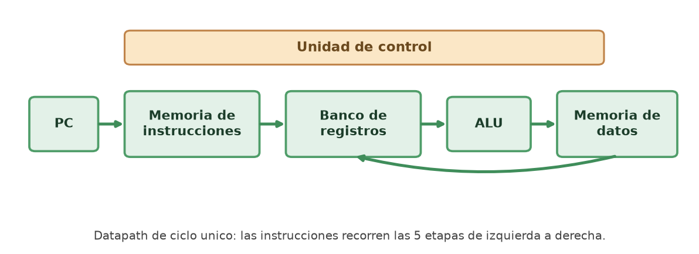
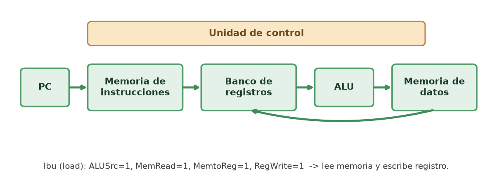
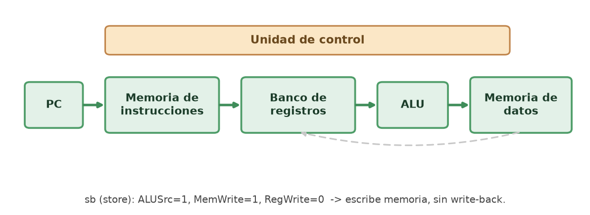
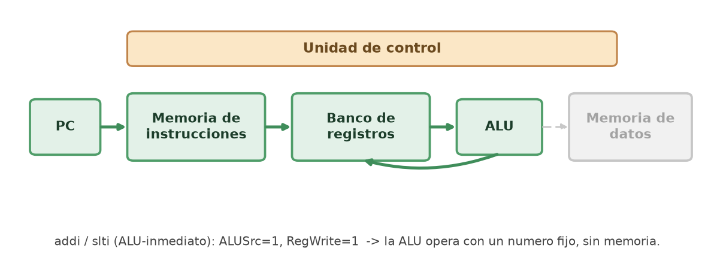
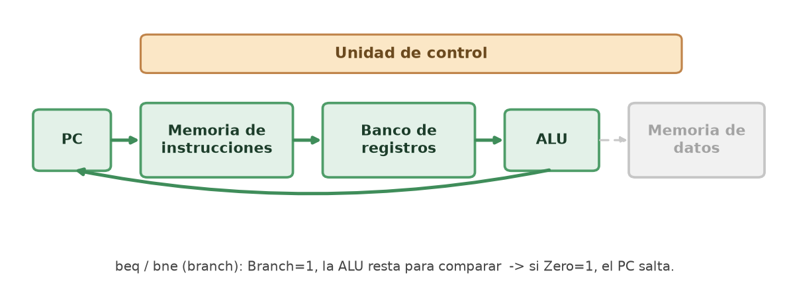
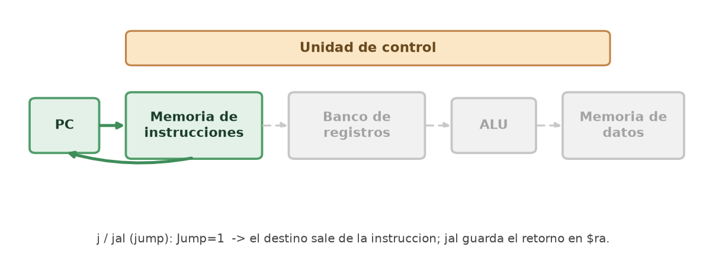
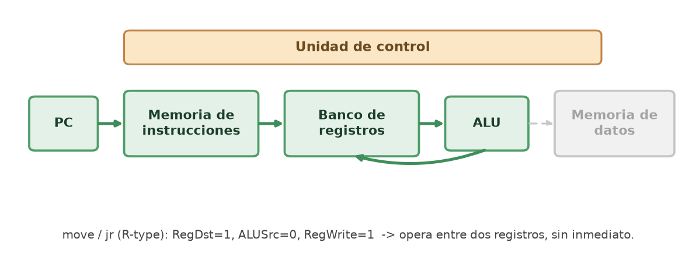

# Laboratorio de Assembler MIPS — Arquitectura de Computadores (INF60500)

Universidad Tecnológica Metropolitana. Documento único con todo lo necesario del
proyecto: algoritmo, código, mapeo del datapath, resultados, análisis y cómo
respaldarlo en GitHub. Sirve como informe de referencia y como bitácora.

> Profesores: Patricio Salgado, Juan Pablo Elgueta y Leonardo Bravo.
> Integrante: Ignacio Moreno. (Grupo: completar nombres.)

---

## Estado del proyecto

- [x] Algoritmo en alto nivel (C y Python).
- [x] Código MIPS verificado en MARS.
- [x] Mapeo del datapath completo (diagrama base + 6 rutas + tabla de señales + traza).
- [x] Informe en Word (`Informe_Laboratorio_MIPS.docx`).
- [ ] Presentación en Canva (10 min).
- [ ] Preparación para las preguntas individuales del profesor.

---

## 1. El problema

El programa recorre la cadena `"holaComoEstas"` y convierte cada letra minúscula a
mayúscula. Si un carácter está entre `'a'` (97) y `'z'` (122), se le resta 32 a su
código ASCII, porque en la tabla ASCII las mayúsculas están 32 posiciones antes que
las minúsculas. Los demás caracteres se dejan igual. Resultado: `HOLACOMOESTAS`.

El problema es corto, pero usa todo lo que pide el enunciado: declaración de datos,
asignaciones, una operación aritmética, comparaciones, un ciclo y una función que se
invoca.

---

## 2. Algoritmo en alto nivel

Se incluye primero en alto nivel porque el enunciado lo exige como referencia (parte
del 10%). C es el que más se parece al assembler: el puntero recorre la memoria igual
que en MIPS.

```c
void transformar(char *s) {
    while (*s != '\0') {              // lee byte y para en fin de cadena
        if (*s >= 'a' && *s <= 'z') { // ¿está entre 'a' y 'z'?
            *s = *s - 32;             // resta 32: pasa a mayúscula
        }
        s++;                          // avanza el puntero
    }
}
```

```python
def transformar(s):
    resultado = []
    for c in s:                   # recorre carácter por carácter
        if 'a' <= c <= 'z':       # ¿es minúscula?
            c = chr(ord(c) - 32)  # resta 32: pasa a mayúscula
        resultado.append(c)
    return ''.join(resultado)

print(transformar("holaComoEstas"))   # -> HOLACOMOESTAS
```

---

## 3. Código MIPS (MARS)

```asm
.data
    mensaje: .asciiz "holaComoEstas"
.text
main:
    la   $a0, mensaje      # carga la dirección de la cadena
    jal  transformar       # llama a la función
    li   $v0, 10           # código de salida
    syscall                # termina el programa

transformar:
    move $t0, $a0          # $t0 apunta al inicio de la cadena
bucle:
    lbu  $t1, 0($t0)       # lee un byte (un carácter)
    beq  $t1, $zero, fin   # si es fin de cadena (\0), termina
    slti $t3, $t1, 97      # ¿es menor que 'a'?
    bne  $t3, $zero, sigue
    slti $t3, $t1, 123     # ¿es menor o igual que 'z'?
    beq  $t3, $zero, sigue
    addi $t1, $t1, -32     # es minúscula: resta 32 -> mayúscula
    sb   $t1, 0($t0)       # guarda el carácter modificado
sigue:
    addi $t0, $t0, 1       # avanza al siguiente byte
    j    bucle
fin:
    jr   $ra               # vuelve a main
```

Tres instrucciones son pseudo-instrucciones que MARS traduce a instrucciones reales:
`la` se convierte en `lui` más `ori`; `li` en `addiu`; y `move` en `addu` con `$zero`.

> **Mejora para la demo:** el código transforma en memoria pero no imprime nada. Para
> ver el resultado en pantalla, antes de `li $v0, 10` conviene imprimir la cadena:
> ```asm
>     la  $a0, mensaje
>     li  $v0, 4        # llamada 4: imprimir cadena
>     syscall
> ```

---

## 4. Marco teórico: el datapath de ciclo único

Cada instrucción se ejecuta por completo en un solo ciclo de reloj. Entra por la
izquierda y avanza por cinco etapas:

1. **Búsqueda (fetch):** el PC indica la dirección y la memoria de instrucciones entrega la instrucción.
2. **Decodificación:** la unidad de control lee el opcode y activa las señales; el banco de registros lee los operandos.
3. **Ejecución:** la ALU suma, resta o compara.
4. **Memoria:** solo las cargas y los almacenamientos acceden a la memoria de datos.
5. **Escritura (write-back):** el resultado vuelve al banco de registros.

No todas las instrucciones usan las cinco etapas. Lo que decide qué se enciende son
las señales de control.



### Componentes (la rúbrica pide al menos 6 para nota máxima)

| Componente | Función en este programa |
|---|---|
| PC | Guarda la dirección de la instrucción actual. |
| Memoria de instrucciones | Entrega la instrucción de 32 bits. |
| Banco de registros | Lee `$t0`, `$t1`, `$a0` y escribe resultados. |
| ALU | Suma, compara y calcula direcciones. |
| Memoria de datos | `lbu` lee un byte, `sb` escribe un byte. |
| Unidad de control | Decodifica el opcode y activa las señales. |

Apoyo: extensor de signo, sumadores (PC+4 y destino de salto) y multiplexores.

---

## 5. Mapeo de las instrucciones

### 5.1 Tipos de instrucción

| Tipo | Formato | Instrucciones del programa |
|---|---|---|
| R | op rs rt rd shamt funct | move (addu), jr |
| I | op rs rt inmediato | lbu, sb, beq, bne, slti, addi, li |
| J | op dirección | j, jal |

### 5.2 Tabla de señales de control

Las 16 instrucciones se reducen a 6 grupos. `X` = no importa.

| Grupo | RegDst | ALUSrc | MemtoReg | RegWrite | MemRead | MemWrite | Branch | Jump | ALUOp |
|---|:--:|:--:|:--:|:--:|:--:|:--:|:--:|:--:|:--:|
| ALU-inmediato | 0 | 1 | 0 | 1 | 0 | 0 | 0 | 0 | add/slt |
| Carga (lbu) | 0 | 1 | 1 | 1 | 1 | 0 | 0 | 0 | add |
| Almacenamiento (sb) | X | 1 | X | 0 | 0 | 1 | 0 | 0 | add |
| Salto cond. (beq/bne) | X | 0 | X | 0 | 0 | 0 | 1 | 0 | sub |
| Salto incond. (j/jal) | X | X | X | 0/1 | 0 | 0 | 0 | 1 | X |
| R-type (move/jr) | 1 | 0 | 0 | 1 | 0 | 0 | 0 | 0 | funct |

### 5.3 La regla de oro (para responder cualquier pregunta)

Tres preguntas por instrucción: qué hace la ALU, si toca la memoria de datos y si
escribe en un registro.

| Grupo | La ALU hace | Memoria de datos | Write-back | Señal que lo distingue |
|---|---|:--:|:--:|---|
| ALU-inmediato | opera con un número fijo | no | sí | ALUSrc = 1 |
| Carga (lbu) | calcula la dirección | lee | sí | MemRead = 1 |
| Almacenamiento (sb) | calcula la dirección | escribe | no | MemWrite = 1 |
| Salto cond. (beq/bne) | resta para comparar | no | no | Branch = 1 |
| Salto incond. (j/jal) | no la usa | no | solo jal | Jump = 1 |
| R-type (move/jr) | opera dos registros | no | sí (move) | RegDst = 1 |

### 5.4 Recorrido por grupo

En las figuras, el verde marca lo que la instrucción usa y el gris lo que queda apagado.

**Carga (lbu).** Usa todo el camino: lee el registro base, la ALU calcula la dirección,
la memoria de datos entrega el byte y se guarda en `$t1`. Única que activa MemRead.



**Almacenamiento (sb).** La ALU calcula la dirección igual, pero la memoria de datos
escribe el byte de `$t1`. No hay write-back. Única que activa MemWrite.



**ALU-inmediato (addi y slti).** La ALU opera con un valor fijo. No toca memoria, pero
sí guarda el resultado en un registro. `addi` suma; `slti` compara y deja 1 o 0.



**Salto condicional (beq y bne).** La ALU resta para comparar; si da cero, el PC salta.
`bne` usa la misma ruta con la condición invertida. No tocan memoria ni registros.



**Salto incondicional (j y jal).** El destino sale de la propia instrucción. `j` solo
cambia el PC; `jal` además guarda el retorno en `$ra`.



**R-type (move y jr).** Operan entre dos registros, sin inmediato (ALUSrc = 0). `move`
(en realidad `addu`) escribe el resultado; `jr` carga `$ra` en el PC para volver.



### 5.5 Traza de ejecución (primer carácter, 'h' = 104)

| Instrucción | Qué ocurre | Componentes activos |
|---|---|---|
| lbu $t1, 0($t0) | Lee la 'h' (104) desde memoria | PC, mem. instr., registros, ALU, mem. datos |
| beq $t1, $zero, fin | 104 ≠ 0, no salta | ALU (resta) |
| slti $t3, $t1, 97 | 104 < 97 es falso, $t3 = 0 | ALU (slt) |
| bne $t3, $zero, sigue | $t3 = 0, no salta (sí es ≥ 'a') | ALU |
| slti $t3, $t1, 123 | 104 < 123 es verdadero, $t3 = 1 | ALU (slt) |
| beq $t3, $zero, sigue | $t3 = 1, no salta (sí es ≤ 'z') | ALU |
| addi $t1, $t1, -32 | 104 - 32 = 72, la letra 'H' | ALU (suma) |
| sb $t1, 0($t0) | Escribe la 'H' en memoria | mem. datos |
| addi $t0, $t0, 1 | Avanza al siguiente byte | ALU |
| j bucle | Vuelve al inicio del ciclo | PC |

Cuando el carácter ya es mayúscula, como la 'C' (67), la primera `slti` deja `$t3` en 1
y el `bne` salta a `sigue`. Así el programa se salta la resta y deja la letra intacta.

---

## 6. Resultados

Al ejecutar el programa en MARS con `"holaComoEstas"`, la memoria queda con
`HOLACOMOESTAS`. Las letras que ya estaban en mayúscula (C y E) no se modifican,
porque la comparación las descarta antes de la resta. La versión en Python entrega el
mismo resultado.

---

## 7. Análisis crítico

El diseño cumple con la rúbrica: integra los seis componentes principales del
procesador y el uso de cada uno es coherente con el modelo de datapath visto en clases.

Hay una limitación de la herramienta. MARS ejecuta y muestra registros y memoria, pero
no dibuja el datapath; por eso el mapeo se hizo de forma conceptual, con diagramas
aparte. DrMIPS sí lo dibuja, pero trabaja con palabras completas (lw y sw), no con
bytes ni cadenas, así que este algoritmo no calza directo con esa herramienta. Esa fue
la razón para quedarnos en MARS.

El programa solo procesa minúsculas del alfabeto inglés. Una letra con tilde o la ñ no
se convierte con la resta de 32, porque su codificación es distinta. Para el alcance
del laboratorio no es problema, pero conviene tenerlo claro por si preguntan.

Dos detalles más: `lbu` y `sb` siguen la misma ruta que `lw` y `sw`, la diferencia está
dentro de la memoria de datos, que mueve un byte en lugar de una palabra. Y `bne`
comparte ruta con `beq`, con la condición invertida.

---

## 8. Conclusiones

El algoritmo funciona en MARS y quedó explicado cómo recorre el procesador. La parte
que más cuesta no es el código, sino seguir cada instrucción por el datapath y
justificar las señales. La regla de las tres preguntas (qué hace la ALU, si toca la
memoria de datos, si escribe en un registro) sirve para armar la ruta de cualquier
instrucción.

Como las preguntas del profesor son individuales, cada integrante debería poder tomar
una instrucción y explicar su recorrido por su cuenta.

---

## 9. Referencias

- Patterson, D. A. y Hennessy, J. L. (2014). *Organización y diseño de computadores: la interfaz hardware/software.* Elsevier.
- Vollmar, K. y Sanderson, P. *MARS: MIPS Assembler and Runtime Simulator.* Missouri State University.
- Bravo, L. Material del curso INF60500: datapath y simulador DrMIPS. Universidad Tecnológica Metropolitana.

---

## 10. Archivos del proyecto

| Archivo | Qué es |
|---|---|
| `PROYECTO_COMPLETO.md` | Este documento (todo en uno). |
| `Informe_Laboratorio_MIPS.docx` | Informe en Word con las figuras incrustadas. |
| `Mapeo_Datapath.md` | Versión solo del mapeo. |
| `conversor_HLL.c` / `.py` | Algoritmo en alto nivel. |
| `figuras/` | Diagramas del datapath en PNG. |
| `generate_figuras.py` | Genera las figuras (matplotlib). |
| `build_informe.js` | Genera el informe en Word (docx-js). |

---

## 11. Cómo subirlo a GitHub

**Opción A (solo navegador, sin comandos):** entra a tu repo, botón *Add file → Upload
files*, arrastra los archivos de la carpeta `arqui` (todo menos `node_modules`) y haz
clic en *Commit changes*.

**Opción B (terminal):** desde la carpeta del proyecto:
```bash
git add .
git commit -m "describe el cambio"
git push
```
La primera vez se abre el navegador para iniciar sesión en GitHub.

Para verlo en otro dispositivo: `git clone <url-del-repo>` o descarga el ZIP desde
GitHub (*Code → Download ZIP*). Deja el repositorio en **Private** por ser un trabajo
con nota.
